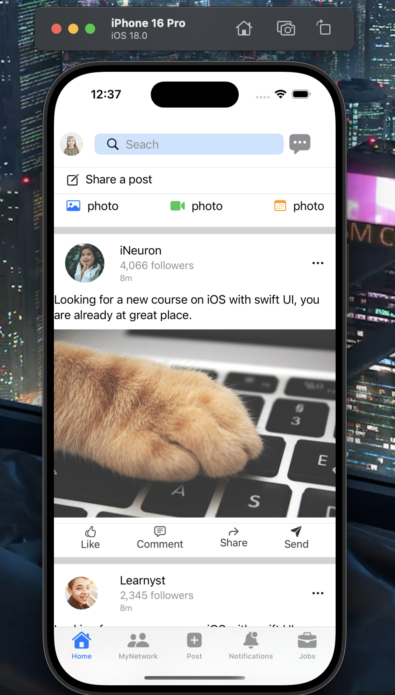
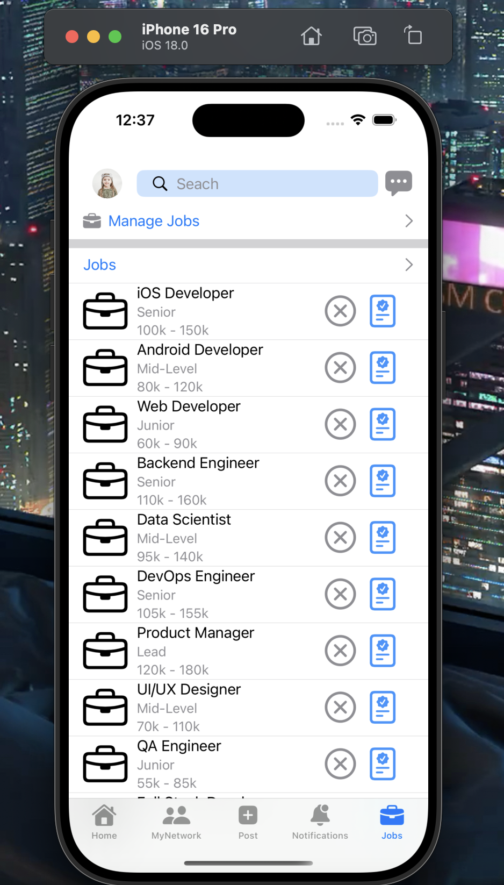
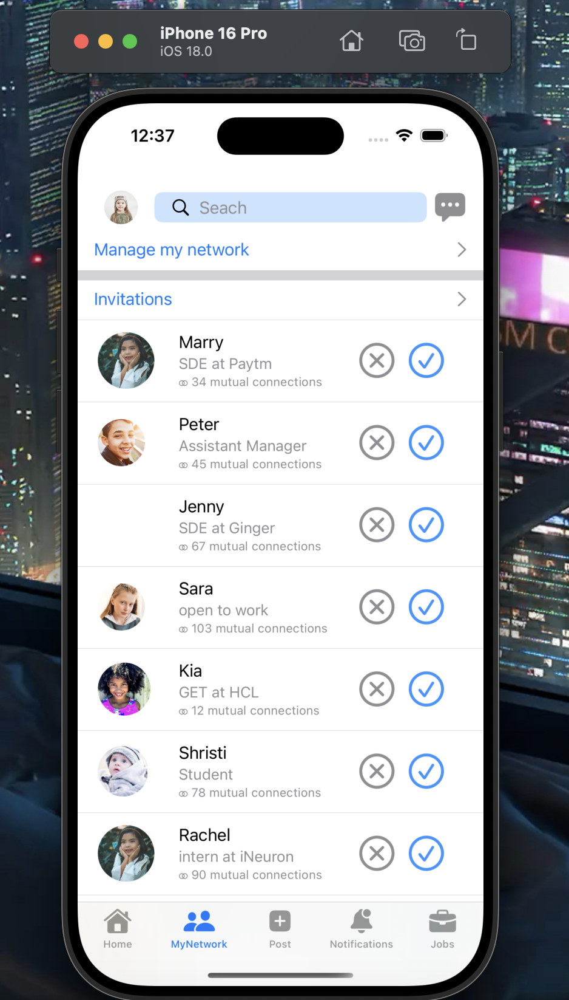
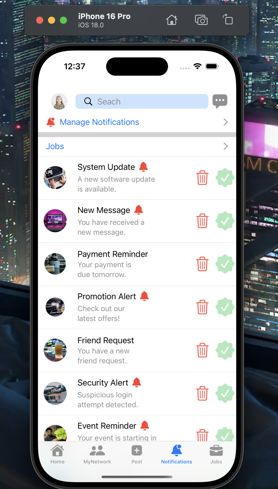

# LinkedIn Features Showcase - Applied MVC Pattern

This repository contains a Swift project that showcases various LinkedIn features using clean UI design and scalable architecture. The project highlights the following LinkedIn views:

- **Home View**
- **Job View**
- **Network View**
- **Notification View**

## 📝 Description

The **LinkedIn Features Showcase** project is a practical implementation that replicates LinkedIn's core UI. The main objective is to design and implement reusable components that represent key pages within LinkedIn's mobile application.

This project includes:

- **Custom UI Components**: To replicate LinkedIn's seamless and responsive UI design.
- **Feature-Specific Screens**: Each view (Home, Job, Network, Notification) showcases different functionalities with reusable Swift components.
- **Swift Patterns and Modularization**: To ensure clean, maintainable, and scalable code.

Below are sample views from the project:

### Home View


### Job View


### Network View


### Notification View


## 🚀 Deployment

This project is designed to run locally on Xcode. Below are the steps to clone and run the project.

## 💻 Installation

To get the project up and running locally:

```bash
# Clone the repository
git clone https://github.com/tuanh00/LinkedIn-Frontend-Clone.git
# Navigate into the project directory
cd LinkedIn-Frontend-Clone

# Open the project in Xcode
open LinkedIn.xcodeproj
```
## 📋 Requirements
- Xcode Version: 14.0 or later
- Swift Version: 5.7
- iOS Deployment Target: iOS 14 or later

## 🎨 Features
- Interactive Home Feed: Displays posts with a clean layout.
- Job, Network, and Notification Views: Render UI with hard-coded data
